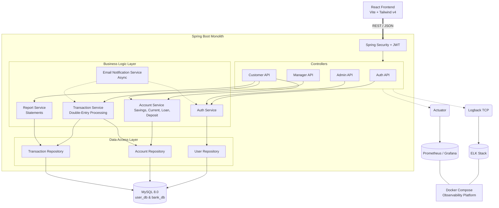

# Online Banking Monolith Application

A full-stack, comprehensive banking application developed using an API-first and Test-Driven Development (TDD) approach. It provides a robust backend system for managing users, accounts, loans, and transactions alongside a modern, responsive React frontend.

## 🚀 Technology Stack

**Backend**
- Java 21
- Spring Boot 3.4.0
- Spring Security (JWT Stateless Authentication)
- Spring Data JPA
- MySQL 8.0
- Bucket4j (Rate Limiting)
- Swagger / OpenAPI 3.0
- JUnit 5 & Mockito

**Frontend**
- React 19 (Vite)
- Tailwind CSS v4
- React Router DOM
- Axios

**Observability & Infrastructure**
- Docker Compose
- ELK Stack (Elasticsearch, Logstash, Kibana)
- Prometheus & Grafana

---

## 🏗️ Architecture Diagram



---

## ⚙️ Steps to Run Locally

### Prerequisites
1. **Java Development Kit (JDK) 21** or higher.
2. **Node.js 20+** and npm.
3. **MySQL 8.0** installed and running on port `3306`.
4. *Optional*: Docker Desktop (for running the observability stack).

### 1. Database Setup
Create a local MySQL database named `bank_monolith_dev`:
```sql
CREATE DATABASE bank_monolith_dev;
```
*(By default, the application is configured to connect to `jdbc:mysql://localhost:3306/bank_monolith_dev` with root password `root` in `application-dev.yml`. Update these properties if your local setup differs).*

### 2. Start the Spring Boot Backend
Open a terminal in the root directory context (`d:\Training\bank-monolith`):
```bash
# Clean and compile the application
mvn clean install -DskipTests

# Run the application with the 'dev' profile
mvn spring-boot:run -Dspring-boot.run.profiles=dev
```
The backend will launch on `http://localhost:8080`.
*(You can verify the API documentation by visiting `http://localhost:8080/swagger-ui/index.html`)*.

### 3. Start the React Frontend
Open a **new** terminal window and navigate to the `frontend` folder:
```bash
cd frontend

# Install dependencies (React, Tailwind, Axios, etc)
npm install

# Start the Vite development server
npm run dev
```
The frontend will launch on `http://localhost:3000` (or the port specified by Vite in your terminal).

---

## 🔧 Troubleshooting Tips

| Issue | Potential Cause | Resolution |
| :--- | :--- | :--- |
| **Backend fails to start / Connection Refused** | MySQL is not running or credentials are wrong. | Ensure MySQL service is active. Verify the `spring.datasource.url`, `username`, and `password` inside `src/main/resources/application-dev.yml`. |
| **Port 8080 or 3000 already in use** | Another service/app is occupying the port. | For Backend: change `server.port` in `application.yml`. For Frontend: update `server.port` in `vite.config.js`. |
| **CORS Errors or 404s on API calls** | Vite Proxy is misconfigured or Backend is down. | Ensure the Spring Boot app is running on `8080`. Check `vite.config.js` to ensure the `/api` target matches the backend URL. |
| **JWT `403 Forbidden` / Login Loop** | Expired tokens stuck in `localStorage`. | Open browser Dev Tools, go to Application -> Local Storage, clear all, and reload the page. |
| **Tests failing with ByteBuddy Error** | Java 25 compatibility issue with Mockito. | The `pom.xml` handles this via the `-Dnet.bytebuddy.experimental=true` flag inside `maven-surefire-plugin`. Ensure you are using `mvn clean test` mapped to the project root. |

---

## 📐 Assumptions Made & Recommended Rules

### Assumptions
1. **Authentication State**: We assume tokens are stored in `localStorage` for immediate convenience and cross-tab persistence during local development.
2. **Single Currency**: All accounts and transactions assume a uniform currency (e.g., USD) omitting FX rates.
3. **Internal Transfers**: We assume transfers occur exclusively between internal monolithic accounts. External routing or clearinghouse (ACH) integrations are simulated/stubbed.
4. **Loan Approvals**: Loans are instantly approved relying wholly on local validation checks (Tenure, Minimum Principle) rather than an asynchronous underwriter review queue.

### Recommended Production Rules
If deploying this application to a staging/production system, adhere to the following recommendations:
1. **JWT Storage**: Migrate JWTs from `localStorage` to **HttpOnly Secure Cookies** to mitigate XSS (Cross-Site Scripting) vulnerabilities.
2. **Database Concurrency**: Implement **Pessimistic Locking** (`@Lock(LockModeType.PESSIMISTIC_WRITE)`) on the `AccountRepository` during transactions (specifically `TRANSFER`) to prevent race conditions during high-concurrency requests.
3. **Asynchronous Processing**: Introduce a robust Message Broker (e.g., **Kafka** or **RabbitMQ**) to handle Email Notifications (`EmailService`) instead of relying solely on Spring `@Async`, which risks dropping emails if the monolithic JVM halts.
4. **Pagination Optimization**: Replace `page=0&size=10` offset pagination on the `ReportService` with keyset/cursor-based pagination if transaction tables start holding millions of rows.
5. **Secret Management**: Never commit raw JWT secrets, passwords, or salts to version control. Inject them securely via Environment Variables or secrets managers (AWS Secrets Manager, Hashicorp Vault).
